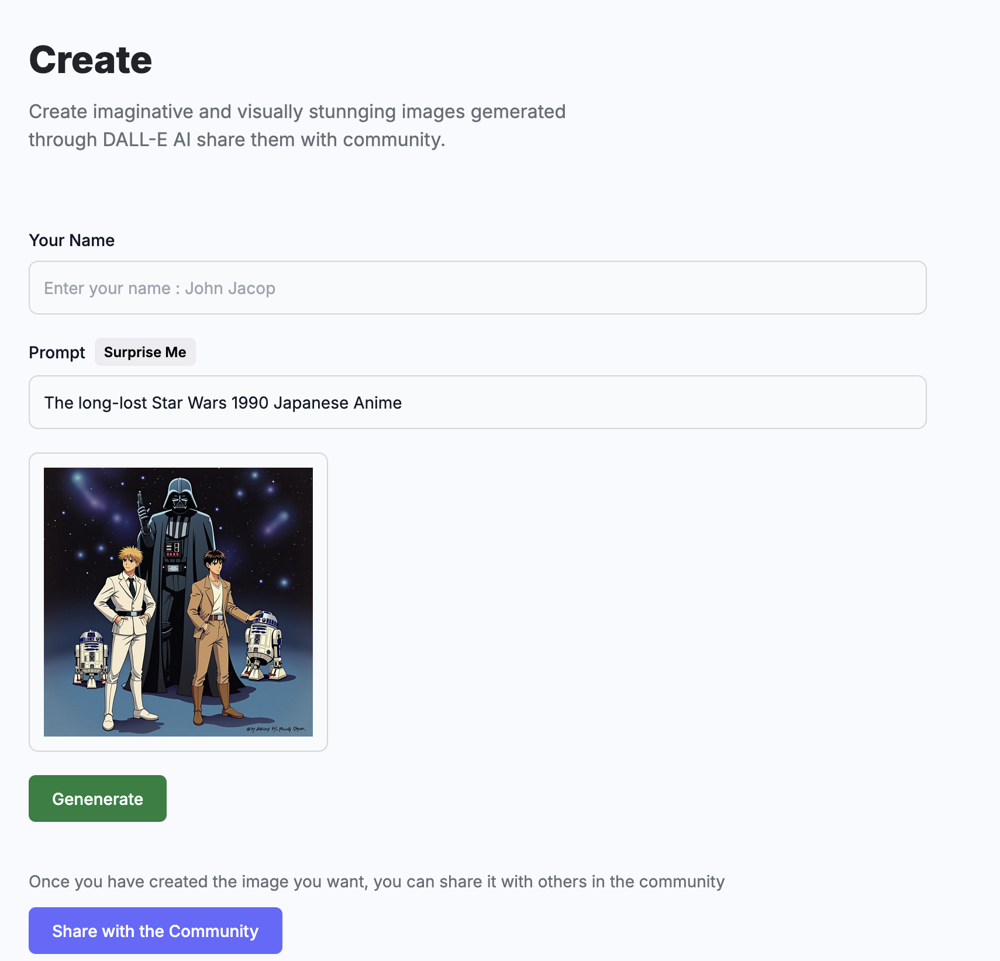
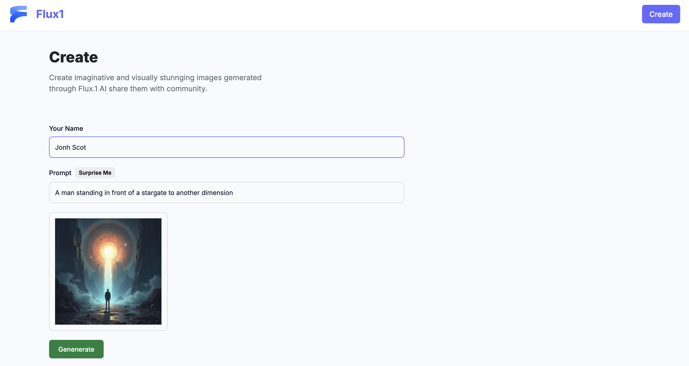
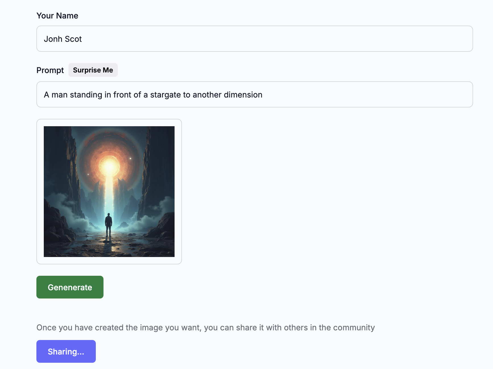
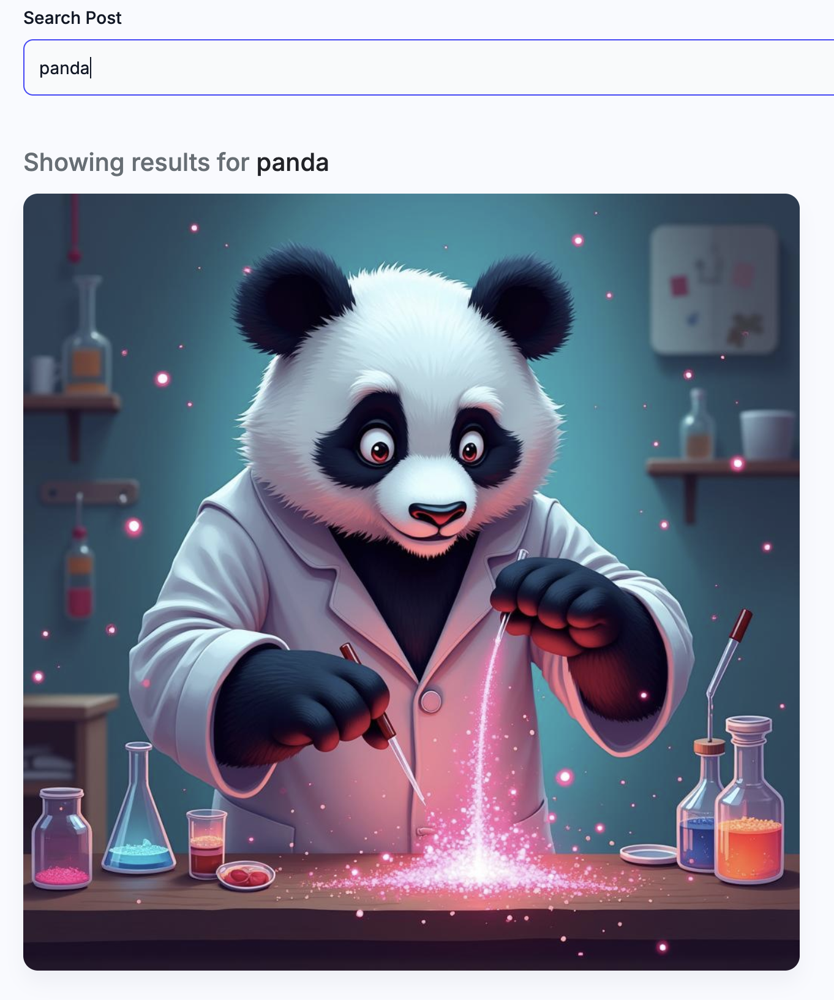

# Image Generator

This project is a cutting-edge web application designed to harness the power of the Hugging Face API for generating unique and creative images. It also provides a platform for users to share and showcase their generated images, fostering a vibrant community of digital artists and enthusiasts.

## Features

- **Image Generation**: Create stunning images using the advanced capabilities of the Hugging Face API.
- **Community Sharing**: Share your generated images with the community and gain feedback.
- **Interactive Browsing**: Explore and interact with a diverse collection of images shared by other users.
- **User Profiles**: Create and manage your profile to keep track of your contributions and favorite images.

## Technologies Used

- **React**: A powerful JavaScript library for building user interfaces.
- **Vite**: A fast and modern build tool for web projects.
- **Tailwind CSS**: A utility-first CSS framework for rapid UI development.
- **ESLint**: A tool for identifying and fixing linting issues in JavaScript code.
- **Hugging Face API**: An API for generating images from textual descriptions using AI.

## Getting Started

1. Clone the repository:
    ```sh
    git clone https://github.com/your-username/image-generator.git
    cd image-generator
    ```

2. Install dependencies:
    ```sh
    npm install
    ```

3. Create a `.env` file in the root directory and add your Hugging Face API key:
    ```env
    VITE_HUGGINGFACE_API_KEY=your_huggingface_api_key
    ```

4. Start the development server:
    ```sh
    npm run dev
    ```

5. Open your browser and navigate to `http://localhost:5173` to see the application in action.

## Example Images

Here are some example images generated by the application:

A BBQ that is alive, in the style of a Pixar animated movie


an astronaut lounging in a tropical resort in space, vaporwave


Here some sample screenshots of the aplication







## Contributing

Contributions are welcome! Please open an issue or submit a pull request if you have any improvements or new features to add.

## License

This project is licensed under the MIT License. See the [LICENSE](http://_vscodecontentref_/0) file for details.